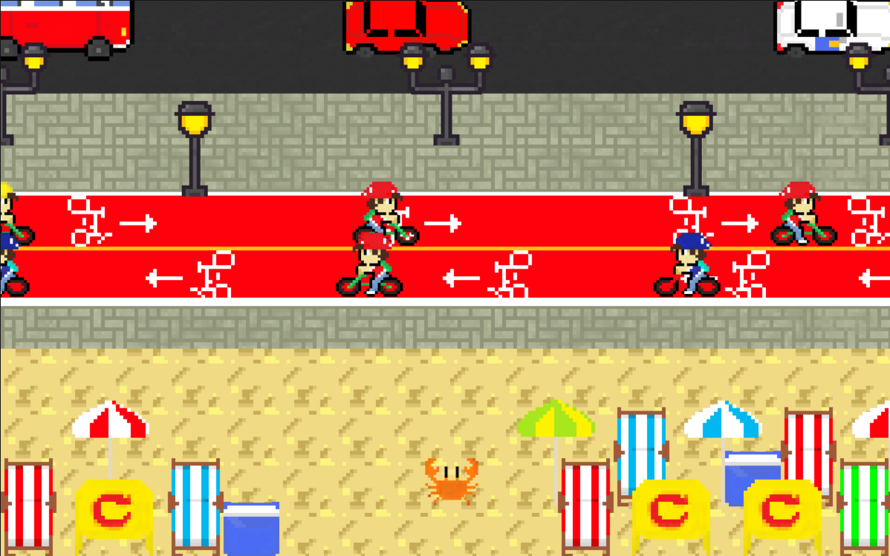

# MangueByte 🦀

> Projeto em equipe de desenvolvimento de jogo em JavaScript, iniciado no treinamento Bolsa Futuro Digital 2025 da Softex Pernambuco

## Conceito

Um jogo arcade estilo Frogger, com ambientação no Centro de Recife, onde você controla um caranguejo que busca chegar até a Softex PE. A movimentação é no WASD e seu objetivo é desviar dos obstáculos e subir até o fim/topo da fase.

## Elementos Principais

- **Personagem:** Caranguejo (inspirado no movimento Manguebeat)
- **Objetivo:** Andar por Recife, desviando de obstáculos até chegar na Softex PE
- **Obstáculos:** Carros, motos, ciclistas, pedestres e objetos inanimados, seja na rua ou pela calçada (dependendo do respectivo obstáculo)
- **Ambientação:** Ruas do Centro de Recife (onde fica a Softex e o Marco Zero)
- **Gráfico:** 2D Simples, com câmera vista de cima para baixo (top-down)
- **Jogabilidade:** Estilo Frogger, com mais obstáculos na tela (podendo vir horizontalmente, como no original, ou verticalmente, dependendo do caminho)
- **Linguagem de programação:** JavaScript (com HTML e CSS para disposição dos elementos visuais)

## Print do Jogo Atual

